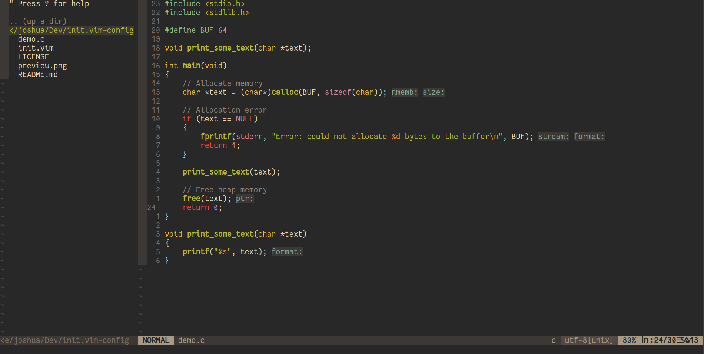

# My Neovim Config

A basic and simple neovim config written in VimScript.



## Installation

### 1. Install [Neovim](https://github.com/neovim/neovim) >= 7.0.0:

### Linux

#### Debian

``` bash
sudo snap install --classic neovim
```
#### Fedora 

``` bash
sudo dnf install neovim
```

#### Arch

``` bash
sudo pacman -S neovim
```

### 2. Create Required Directories

#### Neovim directory

``` bash
mkdir ~/.config/nvim
```

#### Plugins directory

``` bash
mkdir ~/.config/nvim/plugged
```

### 3. Install the [vim-plug](https://github.com/junegunn/vim-plug) Plugin Manager:

#### Linux

``` bash
sh -c 'curl -fLo "${XDG_DATA_HOME:-$HOME/.local/share}"/nvim/site/autoload/plug.vim --create-dirs \
       https://raw.githubusercontent.com/junegunn/vim-plug/master/plug.vim'
```

### 4. Install [Node.js](https://nodejs.org/en/) and [nvm](https://github.com/nvm-sh/nvm)

#### Download the Install Script

``` bash
curl -sL https://raw.githubusercontent.com/nvm-sh/nvm/v0.35.0/install.sh -o install_nvm.sh
```

#### Run the Install Script

``` bash
bash install_nvm.sh
```

#### Restart Terminal

Or use the following command:

``` bash
bash --login
```

#### Install Latest Node.js Version with nvm

Install the latest long-term-support release of Node.js:

``` bash
nvm install --lts
```

### 5. Place ```init.vim``` into ```~/.config/nvim```

#### Clone the repo

``` bash
git clone https://github.com/joshjkk/nvim-config.git
```

#### Move ```init.vim``` into ```~/.config/nvim```

``` bash
mv nvim-config/init.vim ~/.config/nvim/init.vim
```

### 6. Install Plugins

Using the vim-plug plugin manager, use the following command in COMMAND mode to install all the plugged repos:

#### Install Plugins

``` bash
:PlugInstall
```

### 7. Configure coc.nvim Autocompletion

With the coc.nvim example config, <kbd>Tab</kbd> cycles through autocompletion selections, and skips the first.

In order to fix this, **add this line to ```~/.config/nvim/coc-settings.json```**:

```
"suggest.noselect": true
```

### Summary

After all these steps you should be ready to start editing. I hope you enjoy this config, you are free to fork this repo and edit it all you want.

## License

nvim-config is licensed under the MIT License.
